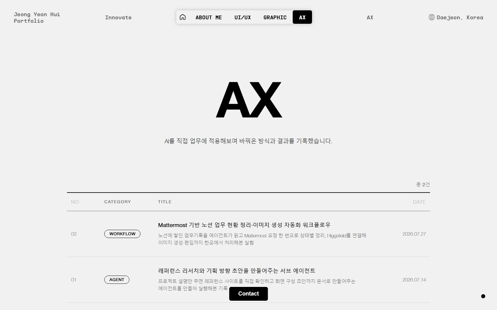

# Yeoni's Portfolio

## 🖋️ From Designer to Deblisher

  

안녕하세요, **UXUI 디자이너 & 퍼블리셔 정연희**입니다.  
편집디자인에서 출발해 지금은 UXUI 디자인과 퍼블리싱을 함께 다루고 있습니다.   
기획부터 디자인, 퍼블리싱까지 직접 진행한 작업물을 모았습니다.

  

## 📝 링크

| 이름                          | 링크                                                                                               |
|-------------------------------|----------------------------------------------------------------------------------------------------|
| 포트폴리오 사이트            | [포트폴리오 Link](https://yeonflower2na.github.io/)          |
| 피그마 디자인 파일             | [피그마 Link](https://www.figma.com/design/52Z1kXW8xBte1H076f8MOL/portfolio?m=auto&t=samqyMTR5XNp228U-6)          |

  

## 🛠️ 기술 스택

| 구분 | 사용 기술 |
|------|-----------|
| 프레임워크 | Next.js 16 (App Router), React 19, TypeScript |
| 스타일 | CSS (전역 스타일시트), Tailwind CSS 4 |
| 애니메이션 | GSAP (ScrollTrigger) |
| 3D | Three.js (GLTF / DRACO) |
| 테스트 | Playwright |
| 배포 | GitHub Pages (GitHub Actions 자동 배포) |

 

처음에는 바닐라 HTML/CSS/JS로 만들었고, 이후 **Next.js로 옮겼습니다.** 
지금 배포되는 버전은 `next-portfolio/` 이며, 저장소 루트의 HTML 파일은 처음 만든 버전을 남겨둔 것입니다.

  

## 🏗️ 전체적인 구조
### Header

  

 
Header는 화면 상단에 고정해 어느 페이지에서든 보이게 했습니다.
중앙에 내비게이션을 두고, 왼쪽에는 포트폴리오 제목, 오른쪽에는 지역 정보를 배치했습니다.
 

**내비게이션 구성**

**- Home**: 아이콘 형태, 누르면 메인으로 이동 
**- ABOUT ME**: 배경과 경력 
**- UI/UX**: 웹 기획, 디자인, 퍼블리싱 프로젝트 
**- GRAPHIC**: 편집디자인과 시각디자인 작업물 
**- AX**: AI를 업무에 적용한 기록  
양쪽 끝 텍스트는 고정하고, 중간 텍스트는 페이지마다 바뀌면서 그 섹션의 주제어를 보여줍니다.
  

### Footer
Footer는 페이지 하단에 두고, 스크롤을 끝까지 내리면 나타나게 했습니다.

  

 
구성 요소

문구: "Where Design Meets Development"로 디자인과 개발을 함께 다룬다는 방향을 적었습니다. 
연락처: 이메일, 연락처, GitHub 링크를 넣었습니다. 
HOME 버튼: 오른쪽 하단에 두었고, 누르면 메인 페이지 첫 번째 섹션으로 이동합니다. 

  
### Contact

  

 
Contact는 화면 하단 중앙에 고정해 어느 페이지에서든 바로 누를 수 있게 했습니다.
누르면 모달이 열리고 이름, 이메일, 연락처, 인스타그램이 한 화면에 나타납니다.

  
### Cursor
마우스를 따라다니는 커스텀 커서를 만들어 적용했습니다. 
배경이 밝으면 검정으로, 어두우면 흰색으로 알아서 바뀌고, 
링크나 버튼 위에 올리면 링 모양으로 커져 누를 수 있는 곳을 알려줍니다.

  
## Intro
인트로는 "From Designer to Deblisher"를 텍스트 애니메이션으로 보여주는 화면입니다. 

  

 
중앙에 배치한 문구가 차례로 등장하며, 세 가지 메시지를 순서대로 보여줍니다. 
From: Designer To: Deblisher →
From: Sketch To: Screen →
From: Idea To: Interaction →
각 문구에는 움직이는 그라데이션 애니메이션을 넣었습니다. 
인트로가 끝나면 메인 섹션으로 넘어갑니다.

  
## Main Page
1페이지는 포트폴리오의 핵심 메시지를 보여주는 화면입니다.

  

 

"From Designer to Deblisher"를 중앙에 크게 배치했습니다.  
디자인과 개발을 함께 다루는 저의 작업 방식을 담은 문장입니다.  
 

Three.js와 GSAP를 활용한 **3D 알파벳 D**  

**D**esigner와 **D**eveloper를 모두 담는 알파벳 D를 
Three.js로 3D로 만들고, GSAP로 움직임을 붙였습니다.
  

**- 입체적 등장 효과**  
알파벳 D는 처음에 뒤쪽에 누워 있어 보이지 않습니다. 
포물선을 그리며 앞으로 나와 화면 중심에 자리 잡습니다. 
  

  

 

**- 호버 및 드래그 기능** 
알파벳 D 위에 마우스를 올리면 **"move Freely"** 라는 안내 텍스트가 나타납니다. 
드래그하면 D를 자유롭게 회전시키거나 움직일 수 있습니다. 
  
**- 스크롤 및 휠 클릭** 
마우스 스크롤로 알파벳 D를 확대할 수 있습니다. 
휠을 누른 채 마우스를 움직이면 크기를 더 세밀하게 조정할 수 있습니다. 
  
**- 설명 텍스트** 
3D 알파벳 D 아래에 설명 텍스트가 나타납니다.
  

  

 
"Where the designer’s ideas meet the Deblisher’s ability to realize them, 
I craft intuitive and practical experiences with care." 
디자이너의 아이디어와 개발자의 실현 가능성이 만나, 
창의와 세심함으로 직관적이고 실용적인 경험을 만들어갑니다.  
스크롤하면 "From Designer"와 "To Deblisher" 두 단어가 분리되며 Preview 섹션으로 넘어갑니다.
  

  

**Preview Section** 
작업물을 미리 보여주는 영역입니다. 카드에 마우스를 올리면 대표 이미지가 나타나고, 누르면 상세 페이지로 이동합니다.
   

## About Page
About 섹션에는 저의 성장 과정과 경력을 담았습니다.

  

 

**- 구성:** 교육, 경력, 자격증 순서로 정리했습니다. 
**- 'About Me' 모달창:**  
버튼을 누르면 자기소개와 성장 배경, 프론트엔드 학습 과정을 담은 모달이 나타납니다.
  
**skill Section**  
익힌 기술을 퍼센트 바로 표시하고, 아래에 기술별 활용 숙련도와 설명을 적었습니다. 
스크롤하면 퍼센트 바가 채워지는 효과를 넣었습니다.
   

## UI/UX Page
UI/UX 섹션에는 제가 진행한 주요 프로젝트를 모았습니다. 
'자세히보기'를 누르면 기획 의도, 화면 구성, 디자인 방향성을 정리한 상세 페이지로 이동합니다.

  

 

**사미텍 홈페이지 리뉴얼**  
[사미텍 홈페이지 바로가기](https://www.samitech.kr/)
 

**- 목적:**  
AI 솔루션과 고용정보 시스템을 다루는 기업의 신뢰감을, 이미지가 아닌 **타이포그래피**로 전달하는 데 초점을 맞췄습니다.  
**- 구성 요소:**  
회사의 비전 문장을 첫 화면 전체를 쓰는 크기로 배치해 메시지가 가장 먼저 읽히게 했습니다. 
장식을 덜어내고 글자 크기와 굵기 차이, 여백만으로 정보 위계를 잡았습니다.
   

**한국소비자원 리뉴얼**  
[한국소비자원 리뉴얼 페이지 바로가기](https://github.com/yeonflower2na/Korea-Consumer-Agency-Renual) 
 

**- 목적:**  
복잡한 메뉴 구조를 간소화하고 정보 접근성을 높이는 데 초점을 맞췄습니다. 
주요 사용층을 분석해 다크 테마를 적용하고 가독성을 높였습니다.  
**- 구성 요소:**  
메뉴 구조를 단순화해 주요 정보를 쉽게 찾을 수 있게 했습니다. 
피해구제 안내는 모달로 단계를 나눠 보여주고, 절차도를 다시 디자인했습니다.  
**- 반응형 디자인:**  
데스크톱과 모바일에서 같은 구조를 유지하도록 만들었습니다.
   
**인터파크 티켓 리뉴얼**  
[인터파크 티켓 리뉴얼 페이지 바로가기](https://github.com/yeonflower2na/interpark-ticket-renewal) 
 
**- 목적:**  
예매를 더 쉽게 할 수 있도록 레이아웃과 기능을 다시 구성했습니다.  
**- 구성 요소:**  
로그인 영역을 오른쪽으로 옮겨 예매 내역과 관심 공연을 한 화면에서 확인할 수 있게 했습니다. 
공연장 페이지에는 지도 API를 넣어 위치를 바로 확인할 수 있게 했습니다. 
대표 공연 리스트는 바닐라 자바스크립트로 만들었고, 마우스를 올리면 공연 정보가 나타납니다.  
**- 클론코딩 프로젝트**  
클래스101 클론코딩: SCSS로 스타일을 정리하면서 주요 레이아웃과 기능을 구현했습니다. 
**- 팀 프로젝트**  
Jurnee: React로 만든 여행 플랜 사이트입니다. 여행 일정 관리와 여행지 추천 기능을 중심으로 제작했습니다. 

  
## GRAPHIC Page
GRAPHIC 섹션에는 이전에 작업한 편집·시각디자인 결과물을 담았습니다. 

  

 

편집디자인, 포스터 디자인, 신문 그래픽디자인으로 나누고 최신순으로 정렬했습니다. 
'All' 탭에서는 전체 작업물을 한 번에 볼 수 있고, 탭을 누르면 해당 카테고리만 남습니다. 
작업물에 마우스를 올리면 대표 이미지가 나타납니다. 
데이터는 `designData.json`으로 분리해 관리합니다.
   

## AX Page
AX 섹션은 AI를 업무에 적용해본 과정과 결과를 기록하는 게시판입니다.

  

 

번호, 카테고리, 제목, 날짜로 정리된 목록에서 글을 고르면 상세 페이지로 이동합니다. 
본문은 마크다운 파일로 관리하고, 렌더링은 라이브러리 없이 직접 만들어 붙였습니다. 
이어서 넣은 이미지는 한 줄로 묶여 보이고, 클릭하면 크게 보면서 좌우로 넘길 수 있습니다. 
글마다 파일을 첨부할 수 있습니다.
   
